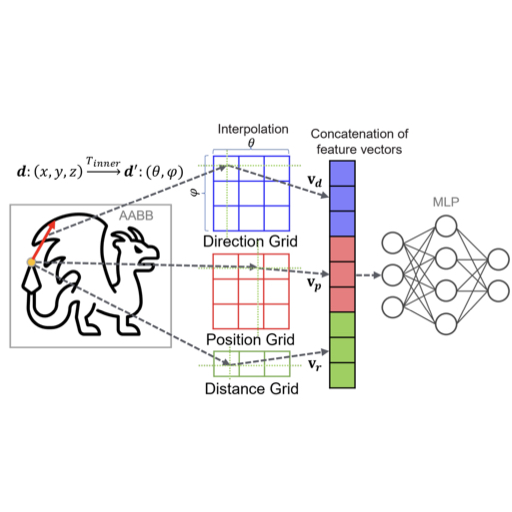
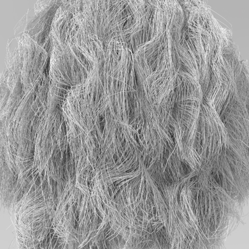

---
# Feel free to add content and custom Front Matter to this file.
# To modify the layout, see https://jekyllrb.com/docs/themes/#overriding-theme-defaults

layout: home
---

## Papers

-  **Neural Intersection Function**,
  - Shin Fujieda, Chih-Chen Kao, Takahiro Harada,
  - High-Performance Graphics - Symposium Papers, 43-53 (2023) [[Arxiv](https://arxiv.org/abs/2306.07191)][[EG](https://diglib.eg.org/handle/10.2312/hpg20231135)]

-  **Subspace Culling for Ray-Box Intersection**,
  - Atsushi Yoshimura, Takahiro Harada,
  - Proceedings of the ACM on Computer Graphics and Interactive Techniques, vol. 6, no. 1 (2023) [[Arxiv](https://arxiv.org/abs/2305.08343)][[ACM](https://dl.acm.org/doi/10.1145/3585503)]

-  **Geometry and Texture Streaming Architecture in Radeon ProRender**,
  - Atsushi Yoshimura, Sho Ikeda, Takahiro Harada,
  - AMD Technical Report No. 22-10-daf5, October 13 (2022)

-  **Progressive Material Caching**,
  - Shin Fujieda, Takahiro Harada,
  - ACM SIGGRAPH ASIA Technical Communications (2022) [[PDF](https://gpuopen.com/download/publications/SA2022_ProgressiveMaterialCache.pdf)]

-  **Combining GPU Tracing Methods within a Single Ray Query**,
  - Pieterjan Bartels, Takahiro Harada,
  - ACM SIGGRAPH ASIA Technical Communications (2022) [[PDF](https://gpuopen.com/download/publications/SA2022_DistanceFieldRT.pdf)]

- Paritosh Kulkarni, Sho Ikeda, Takahiro Harada, **Fused BVH to Ray Trace Level of Detail Meshes**, ACM SIGGRAPH ASIA Posters (2022) [[PDF]()], [[AMD Technical Report, No. 22-10-b79d](https://gpuopen.com/download/publications/GPUOpen2022_FusedLOD.pdf)]
- Guillaume Boissé, Sylvain Meunier, Heloise de Dinechin, Pieterjan Bartels, Alexander Veselov, Kenta Eto, Takahiro Harada, **GI-1.0: A Fast and Scalable Two-level Radiance Caching Scheme for Real-time Global Illumination**, to appear (2022)
- Mehmet Oguz Derin, Takahiro Harada, Yusuke Takeda, Yasuhiro Iba, Compression and Interactive Visualization of Terabyte Scale Volumetric RGBA Data with Voxel-scale Details, SIGGRAPH 2022 Posters (2022)
- Shin Fujieda, Yusuke Tokuyoshi, Takahiro Harada, Stochastic Light Culling for Single Scattering in Participating Media, Eurographics 2022 Short Papers (2022)
- Atsushi Yoshimura, Yusuke Tokuyoshi, Takahiro Harada, Multi-Fragment Rendering for Glossy Bounces on the GPU, EGSR 2022 Industry Track (2022)
- Sho Ikeda, Paritosh Kulkarni, Takahiro Harada, Multi-Resolution Geometric Representation using BoundingVolume Hierarchy for Ray Tracing, AMD Technical Report, No. 22-02-f322, (2022) [[PDF](https://gpuopen.com/download/publications/GPUOpen_BVHApproximation.pdf)]
- Mehmet Oguz Derin, Takahiro Harada, Yusuke Takeda, Yasuhiro Iba, Sparse Volume Rendering using Hardware Ray Tracing and Block Walking, SA '21 Technical Communications: SIGGRAPH Asia 2021 Technical Communications, Article No. 19, Pages 1–4 (2021) [[PDF](https://gpuopen.com/download/publications/SA2021_BlockWalk.pdf)][[ACM](https://dl.acm.org/doi/abs/10.1145/3478512.3488608)]
- 原田隆宏, フレッシュマンに向けたプログラミングのススメ：9．これから世界を視野に入れて働くエンジニアへ, 会誌「情報処理」, Vol.60, No.6(2019) [[LINK](https://ipsj.ixsq.nii.ac.jp/ej/?action=pages_view_main&active_action=repository_view_main_item_detail&item_id=195582&item_no=1&page_id=13&block_id=8)]
- Yusuke Tokuyoshi and Takahiro Harada, Hierarchical Russian Roulette for Vertex Connections, ACM Transactions on Graphics 38, 4, 36 (2019)
- Yusuke Tokuyoshi and Takahiro Harada, Bidirectional Path Tracing Using Backward Stochastic Light Culling, ACM SIGGRAPH 2018 Talks (2018)
- Young J. Kim, SeongKi Kim, Takahiro Harada, Energy-efficient Global Illumination Algorithms for Mobile Devices using Dynamic Voltage and Frequency Scaling, Computers & Graphics Vol. 70, 198-205 (2018) [Link]
- Yusuke Tokuyoshi and Takahiro Harada, Stochastic Light Culling for VPLs on GGX Microsurfaces, Computer Graphics Forum 36, 4 (EGSR 2017) (2017)
- A Framework to Transform In-Core GPU Algorithms to Out-of-Core Algorithms (2016) [[Abstract](https://github.com/takahiroharada/takahiroharada.github.io/raw/master/publications/2016_i3d.pdf), [Sup](https://github.com/takahiroharada/takahiroharada.github.io/raw/master/publications/2016_i3d_sup.pdf)]
- Yusuke Tokuyoshi, Takahiro Harada, Stochastic Light Culling, The Journal of Computer Graphics Techniques (2016) [PDF]
- Takahiro Harada, Masahiro Fujita, Ray Tracing Irregularly Distributed Samples on Multiple GPUs, High Performance Graphics Poster (2014) [Project, [Abstract](https://github.com/takahiroharada/takahiroharada.github.io/raw/master/publications/2014_hpg.pdf)]
- Takahiro Harada, Micro-buffer Rasterization Reduction Method for Environment Lighting Using Point-based Rendering, Graphics Interface (2014)[Paper]
- Dongsoo Han, Takahiro Harada, Tridiagonal Matrix Formulation for Inextensible Hair Strand Simulation, VRIPHYS, 11-16 (2013) [Paper]
- Takahiro Harada, A 2.5D Culling for Forward+, SIGGRAPH ASIA 2012 Technical Brief, No.18 (2012)[Abstract, Slide][ACM]
- Dongsoo Han, Takahiro Harada, Real-time Hair Simulation with Efficient Hair Style Preservation, VRIPHYS, 5-8 (2012)[EG][PDF, Slide] (Simulation tech of TressFX)
- Takahiro Harada, Jay McKee, Jason C.Yang, Forward+: Bringing Deferred Lighting to the Next Level, Eurographics Short Paper, 5-8 (2012)[Paper][Slide]
- Xuan Yu, Jason C. Yang, Justin Hensley, Takahiro Harada, Jingyi Yu, A Framework for Rendering Complex Scattering Effects on Hair, Proceedings of ACM SIGGRAPH Symposium on Interactive 3D Graphics & Games, 111-118 (2012)  (Rendering tech of TressFX)
- Takahiro Harada, Heterogeneous Particle-Based Simulation, SIGGRAPH ASIA 2011 Sketch, No.19 (2011)[ACM]
- Takahiro Harada, A Parallel Constraint Solver for a Rigid Body Simulation, SIGGRAPH ASIA 2011 Sketch, No.22 (2011)[ACM]
- Fuchang Liu, Takahiro Harada, Youngeun Lee, Young J. Kim, Real-time Collision Culling of a Million Bodies on Graphics Processing Units, ACM Transactions on Graphics, SIGGRAPH ASIA (2010)[ACM] 
- Ren Yasuda, Takahiro Harada, Yoichiro Kawaguchi, Fast Rendering of Particle-Based Fluid by Utilizing Simulation Data, Eurographics Short Paper (2009)[EG]
- Takahiro Harada, Issei Masaie, Seiichi Koshizuka, Yoichiro Kawaguchi, Massive Particles: Particle-based Simulations on Multiple GPUs, SIGGRAPH 2008 Talk [PDF]
- Ren Yasuda, Takahiro Harada, Yoichiro Kawaguchi, Real-Time Simulation of Granular Materials using Graphics Hardware, International Conference on Computer Graphics, Imaging and Visualisation, 28-31 (2008)
- Seiichi Koshizuka, Yukihito Suzuki, Takahiro Harada, Multi-physics Simulation for Micro Fluidic Devices Using Moving Particle Semi-Implicit Method, Proc. of WCCM8/ECOMAS2008, (2008)[PDF]
- Takahiro Harada, Seiichi Koshizuka, Katsunori Shimazaki, A Wall Boundary Computation Model by Polygons for Moving Particle Semi-Implicit Method, Proc. of WCCM8/ECOMAS2008, (2008) to Appear
- Takahiro Harada, Seiichi Koshizuka, Yoichiro Kawaguchi, Slided Data Structure for Particle-based Simulations on GPUs, Proc. of GRAPHITE, 55-62(2007) [PDF]
- Takahiro Harada, Masayuki Tanaka, Seiichi Koshizuka, Yoichiro Kawaguchi, Real-time Coupling of Fluids and Rigid Bodies, Asian-Pacific Congress on Computational Mechanics(2007)The Best Computer Visualization Award
- Takahiro Harada, Seiichi Koshizuka, Yoichiro Kawaguchi, Construction of Non-Blobby Surface from Particles, Eurographics Short Paper, 41-44(2007) [PDF][EG]The Best Poster Prize (Photo from EG07 site. Thanks! X, X)
- Takahiro Harada, Masayuki Tanaka, Seiichi Koshizuka, Yoichiro Kawaguchi, Real-time Particle-based Simulation on GPUs, SIGGRAPH 2007 Poster (2007) [PDF]
- Masahiro Kondo, Masayuki Tanaka, Takahiro Harada, Seiichi Koshizuka, Elastic Objects for Computer Graphic Field using MPS method, SIGGRAPH 2007 Poster (2007) [PDF]
- Yuki Shimada, Mikio Shinya, Michio Shiraishi, Takahiro Harada, Real-time Rendering of Dynamic Clouds, SIGGRAPH 2007 Poster (2007)
- Takahiro Harada, Seiichi Koshizuka, Yoichiro Kawaguchi, Real-time Fluid Simulation Coupled with Cloth, Proc. of Theory and Practice of Computer Graphics, 13-20(2007) [PDF][EG] Ken Brodlie Prize for Best Paper, Third Place
- Takahiro Harada, Seiichi Koshizuka, Yoichiro Kawaguchi, Smoothed Particle Hydrodynamics on GPUs, Proc. of Computer Graphics International, 63-70(2007) [PDF]
- Takahiro Harada, Masayuki Tanaka, Seiichi Koshizuka, Yoichiro Kawaguchi, Acceleration of Rigid Body Simulation using Graphics Hardware, Symposium on Interactive 3D Graphics and Games(2007)
- Takahiro Harada, Seiichi Koshizuka, Yoichiro Kawaguchi, Smoothed Particle Hydrodynamics in Complex Shapes, Spring Conference on Computer Graphics, 235-241(2007)[PDF]1st The Best Paper Award
- Takahiro Harada, Seiichi Koshizuka, Yoichiro Kawaguchi, Acceleration of Smoothed Particle Hydrodynamics using Graphics Hardware, International Conference on Computational Methods(2007)
- Takahiro Harada, Seiichi Koshizuka, Yoichiro Kawaguchi, Improvement of the Boundary Conditions in Smoothed Particle Hydrodynamics, Computer Graphics & Geometry, Vol. 9, No. 3, 2-15 (2007) [LINK]
- Takahiro Harada, Yukihito Suzuki, Seiichi Koshizuka, Takahiro Arakawa, Shuichi Shoji, Meshless Simulation for Micro Droplet Generation, Proc. of Micro Total Analysis Systems, vol.1, 86-89(2006)
- Takahiro Harada, Yukihito Suzuki, Seiichi Koshizuka, Takahiro Arakawa, Shuichi Shoji, Simulation of Droplet Generation in Micro Flow using MPS Method, Japan Society of Mechanical Engineering International Journal Series B, Vol.49, No.3, 731-736(2006)[INDEX]
- Takahiro Harada, Seiichi Koshizuka, Real-time Cloth Simulation Interacting with Deforming High-Resolution Models, SIGGRAPH 2006 Poster, 129(2006)ACM Student Research Competition Finalist [ACM]
- Takahiro Harada, Yukihito Suzuki, Seiichi Koshizuka, Takahiro Arakawa, Shuichi Shoji, Numerical Analysis of Micro Multi-phase Flow using MPS Method, Proc. Of 7th World Congress on Computational Mechanics,1223(2006)
- Takahiro Harada, Yukihito Suzuki, Seiichi Koshizuka, Takahiro Arakawa, Shuichi Shoji, Numerical Analysis of Micro Droplet Generation using a Particle Method, Proc. Of Micro Total Analysis Systems, Vol.1,638-640(2005)

## Conference Talks

-  HIP RT: A Ray Tracing Library in HIP
  - Takahiro Harada
  - High Performance Graphics 2022 Hot3D (2022)
-  Real-Time Ray-Tracing Techniques for Integration into Existing Renderers, 
  - Takahiro Harada
  - GDC (2018)
- Takahiro Harada, Radeon ProRender and Radeon Rays in a Gaming Rendering Workflow, GDC (2017)
- Yusuke Tokuyoshi and Takahiro Harada, Stochastic Light Culling, I3D (2017) [Slide + Code]
- A. Keller, I. Wald, T. Harada, D. Kozlov, R. Karrenberg, L. Peterson, T. Hector, The Quest for The Ray Tracing API, SIGGRAPH Course (2016) [Project]
- Takahiro Harada, Dmitry Kozlov, Multiplatform GPU Ray-Tracing Solutions With FireRender and FireRays, GDC (2016)
- Takahiro Harada, Foveated Ray Tracing for VR on Multiple GPUs, SIGGRAPH ASIA 2014 Course (2014)
- Takahiro Harada, モンテカルロレイトレーシングの基礎からOpenCLによる実装まで, CEDEC (2013) [Slide]
- Dongsoo Han, Takahiro Harada, Real-time Hair Simulation and Rendering for Games(ゲームのためのリアルタイムヘアーシミュレーションとレンダリング), CEDEC (2013) [Slide]
- 西川善司の「CEDEC 2013」ゲーム開発マニアックス(グラフィックス編), CEDEC (2013)
- Takahiro Harada, Jay McKee, The AMD Leo Demo Deep Dive, CEDEC (2012)[Slide]
- PTex and Vector Displacement in AMD Demos, CEDEC (2012)
- Jay McKee, Takahiro Harada, Forward Rendering Pipeline for Modern GPUs, GDC Europe (2012)
- Erwin Coumans, Takahiro Harada, GPU Accelerated Rigid Body and Soft Body Game Physics, AMD Fusion Developer Summit(2012)[Slide]
- S. Frye, T. Harada, Y. J. Kim, S.-e. Yoon, Recent Advances in Real-Time Collision and Proximity Computations for Games and Simulations, Eurographics(2012)
- Takahiro Harada, Physics for Game Programmers, Game Developers Conference(2012)
- Justin Hensley, Derek Gerstmann, Takahiro Harada, OpenCL by Example, SIGGRAPH ASIA 2011 Course (2011)
- Takahiro Harada, Erwin Coumans, Game Programming on Hybrid CPU-GPU Architectures, Destruction for Games, CEDEC(2011)
- Takahiro Harada, Physics Panel Discussion, CEDEC(2011)
- Takahiro Harada, Destruction and Dynamics for Film and Game Production, SIGGRAPH Course(2011) [Slide]
- Takahiro Harada, Physics Simulation on Fusion Architecture, AMD Fusion Developer Summint(2011) [Slide]
- Takahiro Harada, Designing Physics Algorithms for GPU Architecture, Physics for Game Programmers, Game Developers Conference(2011)
- Takahiro Harada, DX11 Techniques in HK2207, AMDs Favorite Techniques, Game Developers Conference(2011)
- Justin Hensley, Derek Gerstmann, Takahiro Harada, OpenCL by Example, SIGGRAPH ASIA 2010 Course(2010)
- Takahiro Harada, Physics Panel Discussion, CEDEC(2010)
- Sung-Eui Yoon, Takahiro Harada, Young J.Kim, Recent Advances in Real-Time Collision and Proximity Computations for Games and Simulations, SIGGRAPH ASIA 2010 Course(2010) 
- Takahiro Harada, Physics Simulations on the GPU, Physics for Programmers, Game Developers Conference(2010) [PDF]
- Takahiro Harada, Parallelizing the Physics Pipline: Physics Simulations on the GPU, Math for Programmers/Physics for Programmers (Tutorial), Game Developers Conference (2009) [PDF] 

